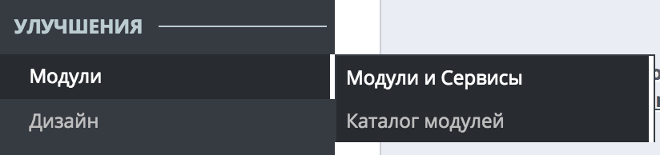
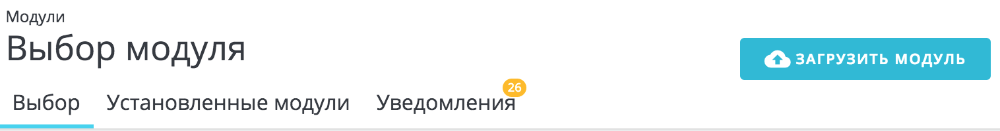
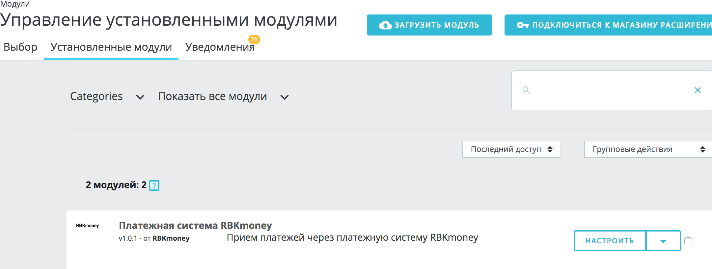
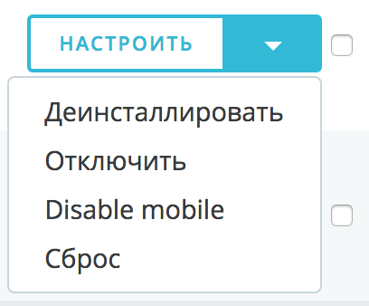
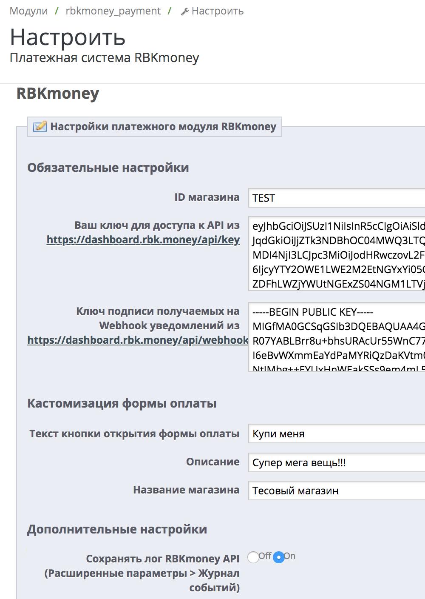
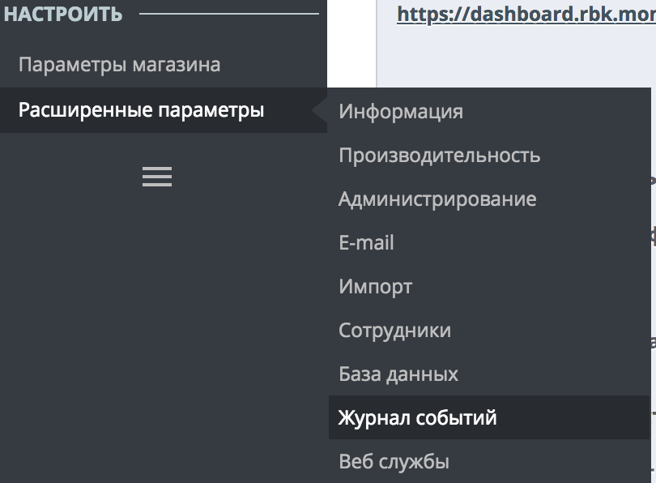
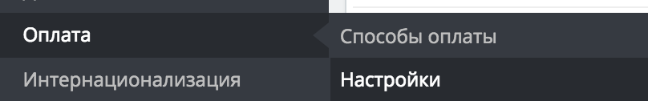

# rbkmoney-cms-prestashop

Пожалуйста, обязательно делайте бекапы!

Модуль разрабатывался и тестировался на Opencart 1.7.2.0

#### Требования

- PHP 5.4 (минимум)
- OpenSSL - 1.0.2k-fips (минимум)
- Curl

#### Доступные ставки НДС для корзины

- ничего не указано - без НДС
- 0 - 0% НДС
- 10 - 10% НДС
- 20 - 20% НДС

### Установка и настройка модуля

#### Установка без архива

1. Скачиваем архив. Заходим в "Модули", выбираем "Модули и сервисы"

Нажимаем "Загрузить модуль", указываем путь к архиву. 

После чего заходим в `установленные модули` и находим модуль `RBKmoney`

Активируем его в выпадающем меню

Дальше занимаемся настройкой модуля

#### Вручную:

1. Помещаем папку "rbkmoney_payment" с модулем в директорию 'modules'

2. Включаем модуль в разделе (Модули > Модули и сервисы > Установленные модули). 

После чего заходим в `установленные модули` и находим модуль `RBKmoney`

Выбираем "Платежная система RBKmoney" и нажимаем "Настроить"

Дальше занимаемся настройкой модуля

#### Для начала приема платежей на Вашем сайте осталось совсем немного

Настройте плагин в соответствии с данными из [личного кабинета RBKmoney](https://dashboard.rbk.money).

`ID магазина` - идентификатор магазина из RBKmoney. Скопируйте его в Личном кабинете RBKmoney в разделе Детали магазина, поле Идентификатор;

`Api ключ` - ключ для доступа к API. Скопируйте его в Личном кабинете RBKmoney в разделе API Ключ

`Публичный ключ` - ключ для обработки уведомлений о смене статуса

- Заходим в личный кабинет RBKmoney: Создать Webhook;
- Вставляем в поле URL вида `http://YOUR_SITE/index.php?fc=module&module=rbkmoney_payment&controller=validation`
- Выбираем Типы событий `InvoicePaid` и `Invoice Canсelled`;
- после создания Webhook-а копируем Публичный ключ после нажатия Показать детали;
- скопированный ключ вставляем в поле `Публичный ключ` на странице настроек модуля;

- Сохраните изменения и проведите тестовый платеж

В целях отладки можно включить логирование ответов от RBKmoney. 

В этом случае они будут отображаться в логах (раздел меню `Расширенные параметры > Журнал событий`)

## Настройка модуля в самой CMS

Общие настройки для платежных методов, которые влияют на его вывод к оплате

Оплата / Настройки (настройки)

 - ограничение валют (выбираем вылюту)
 - ограничение групп (указываем группы)
 - ограничение стран (отмечаем страны)
 - ограничения перевозчика (проставляем перевозчиков)

### Нашли ошибку или у вас есть предложение по улучшению модуля?

Пишите нам support@rbkmoney.com При обращении необходимо:

- Указать наименование CMS и компонента магазина, а также их версии
- Указать версию платежного модуля
- Описать проблему или предложение
- Приложить снимок экрана (для большей информативности)